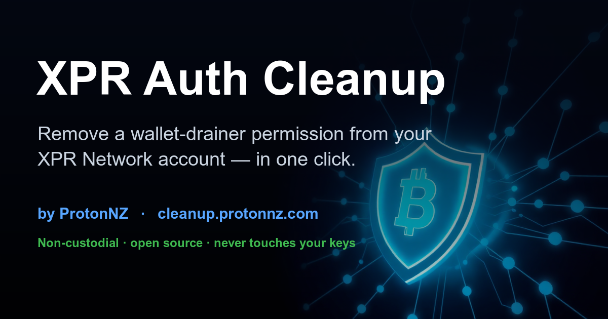
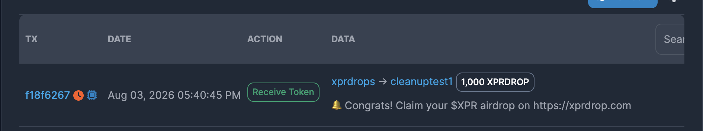

# XPR Auth Cleanup



**Live: [cleanup.protonnz.com](https://cleanup.protonnz.com)** · by [ProtonNZ](https://x.com/protonnz)

A free, **non-custodial** web tool that finds and removes malicious **delegated permissions**
from an XPR Network account — in a single transaction the account owner signs themselves.

It was built in response to the `xprdrop.com` wallet-drainer campaign, which tricks users into
signing an `updateauth` that hands an attacker account a permission (named `claim`) over their
wallet, then drains their tokens. Removing that permission by hand on a block explorer means
20+ separate `unlinkauth` calls plus a `deleteauth`. This tool does it in one signed transaction.

## What the scam looks like

**The lure** — an unsolicited token whose memo advertises the fake airdrop site. Receiving it is
harmless; the danger is only if you open the link and connect your wallet there:



**The fake site** (annotated) — it exists only to make you sign the drainer permission:


## How it works

1. Connect your WebAuth / Anchor wallet — or type any account name for a **read-only audit**.
2. The tool inspects every permission and every linked action, and flags anything controlled by
   an account that **isn't you** (known drainer accounts are marked critical).
3. If it finds the malicious permission, it builds one transaction — `unlinkauth` for each
   linked action, then `deleteauth` — and shows you every action, in plain language and raw JSON,
   before you sign.

## Security model

- **Non-custodial.** You sign in your own wallet. The tool never sees or stores your keys.
- **No backend.** It's a single static page that reads public chain data (RPC + Hyperion).
- **It can only remove access.** The only actions it ever builds are `unlinkauth` / `deleteauth`.
  It cannot move funds or add permissions.
- **It won't touch core permissions.** It refuses to auto-delete `owner`/`active` (which could
  lock you out) and instead tells you to reset them with help from WebAuth / Metallicus.
- **Auditable.** The entire tool is this one `index.html`. Read it before you trust it.

### If you hold staked XPR — order matters

A drainer permission is usually linked to token *transfers* but not to unstaking. While your XPR
is staked it's out of reach, but the moment it's unstaked to liquid it can be swept. **Remove the
permission FIRST, then unstake.** The tool detects staked balances and warns you.

## Verifying this is genuine

This tool asks you to connect a wallet and sign an auth transaction — the same shape as the scam
it fixes — so verify it:

- It is announced from ProtonNZ's official X: [@protonnz](https://x.com/protonnz).
- It is served only from **protonnz.com**. Never trust a copy on another domain.
- The source is right here. Nothing is hidden.

## Run locally / self-host

Static site, no build step:

```bash
# any static server
npx serve .
# or deploy to Vercel
vercel --prod
```

Notes for self-hosters:
- Networks and the malicious-account list are configured at the top of the `<script>` in `index.html`.
- For production, pin the Proton Web SDK to a specific version and vendor it locally rather than
  loading it from a CDN.

## Credits

The `xprdrop.com` campaign was originally flagged by
[George Kurupt](https://x.com/GeorgeKurupt/status/2083019834787271114). Tool built and maintained
by [ProtonNZ](https://x.com/protonnz), an XPR Network block producer.

Not affiliated with any airdrop. MIT licensed.
